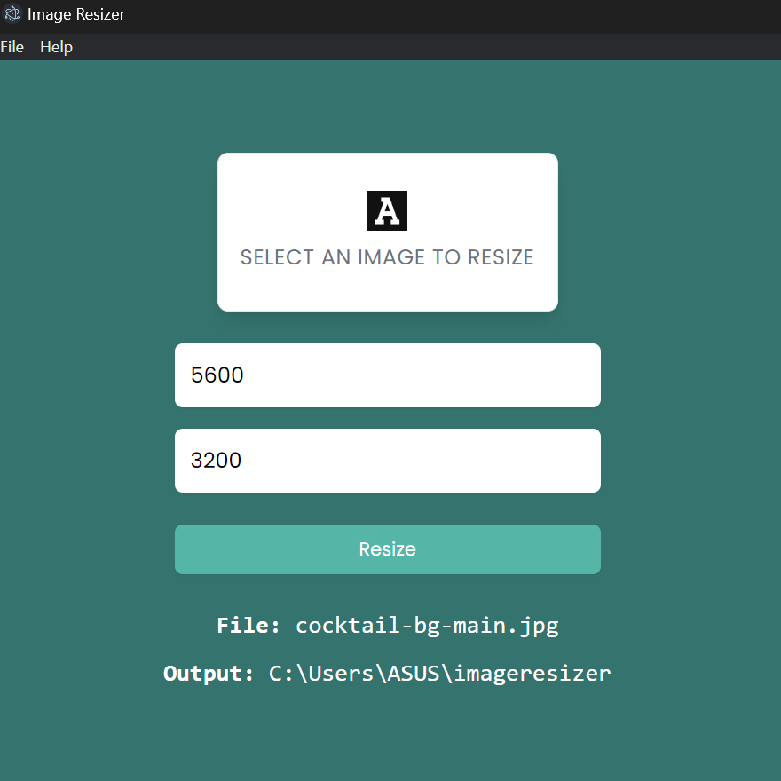

  <h2>App under construction.</h2>
  Electron app that is able to resize photos.

 
Technologies used: Electron.js

## Summary

0. Upload a photo - possible formats: gif, jpeg, png, jpg, webp.
1. The app displays the dimensions, name and path of the photo.
2. Resize it to a desired dimensions.

## App images

## How to run

### `git clone` https://github.com/andrei-alexandrov/electron-image-resizer.git
### `cd` electron-image-resizer
### `npm install`
### `npm start`
